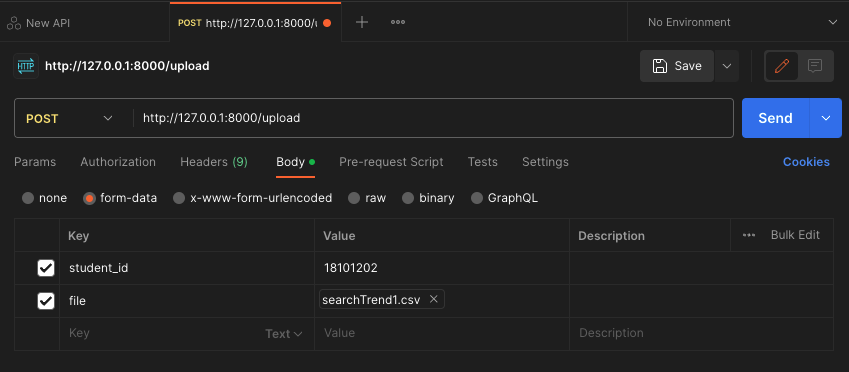

# 전기정보공학과 과제 사이트 개발 서버
전기정보공학과 과제사이트 개발 서버 base code 입니다.

## 환경 설치
```
pip install -r requirements.txt
```

## 서버 실행
```
uvicorn main:app --reload
// 모든 호스트 허용, 포트 80번
uvicorn main:app --host 0.0.0.0 --port 80
```

## postman 으로 api 테스트
서버 실행 후 아래 그림과 같이 post 요청시 메세지를 받을 수 있다.



```json
{
    // 성공시 메세지
    "message": "파일 업로드 성공"
}

{
    // 실패시 메세지
    "error": "파일 업로드 실패"
}
```
